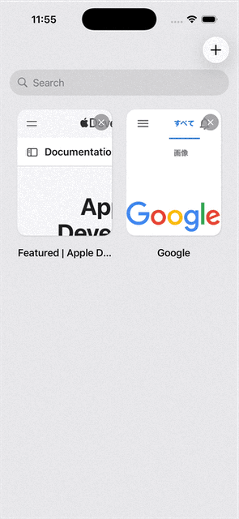
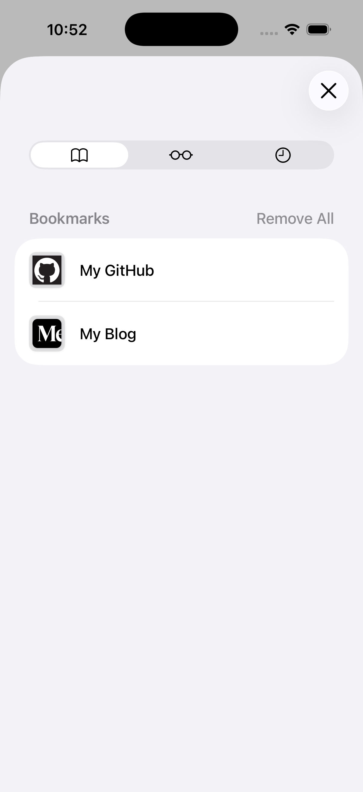
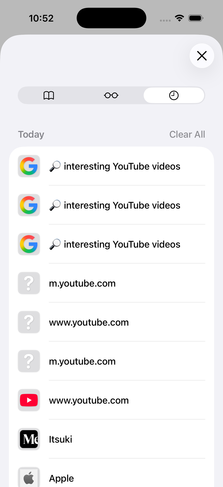
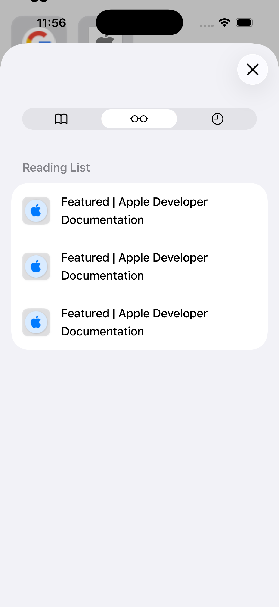
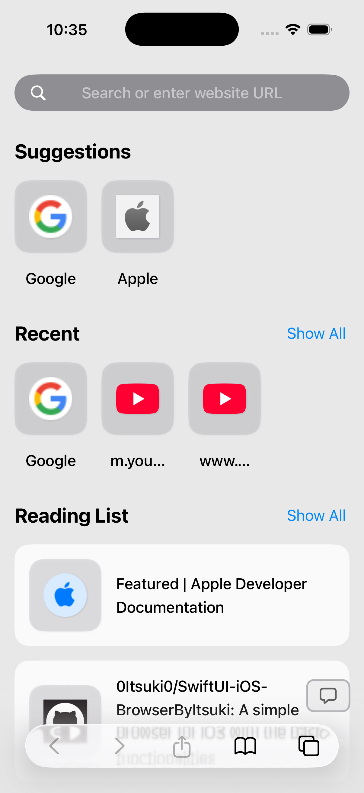
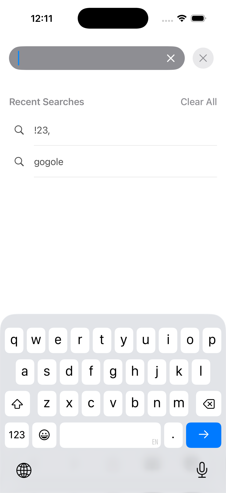

#  SwiftUI/iOS: Simple Browser App

A simple browser for iOS with the following functionalities.

- Search by keyword or direct URL entry
- Reload or cancel loading a page
- Add a page as Bookmark or Reading List
- Share a page
- Browse histories

## Permissions May Request

| Category             | Permission                                                                                |
| :------------------- | :---------------------------------------------------------------------------------------- |
| Photo Library (Save) | Privacy - Photo Library Additions Usage Description (`NSPhotoLibraryAddUsageDescription`) |
| Device Location      | Privacy - Location When In Use Usage Description (`NSLocationWhenInUseUsageDescription`)  |

## Demo

### Overall

### Individual Functionalities

  
  
  

  
  

## License

[License](./LICENSE)

## Privacy Policy

[Privacy Policy](./privacy.html)