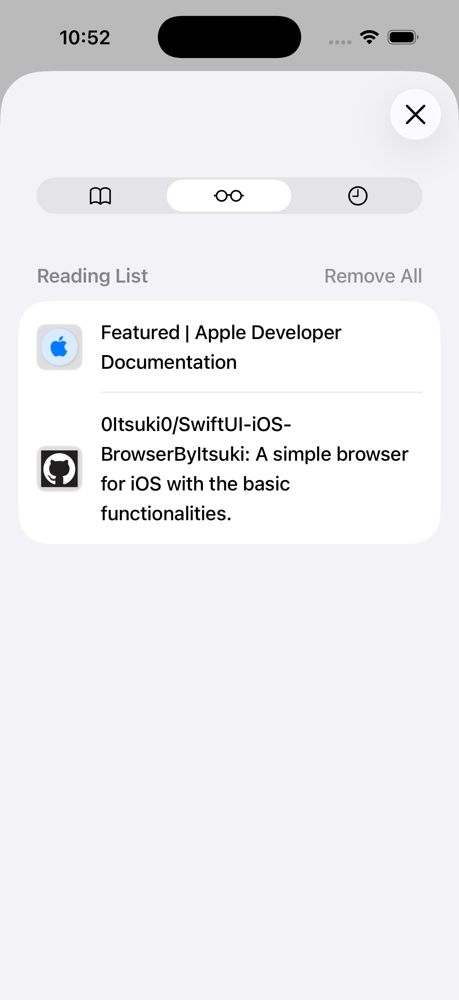

#  SwiftUI/iOS: AI Powered Browser App

### ⭐⭐ An AI (Apple Intelligence) powered browser for iOS/iPadOS with the following functionalities. ⭐⭐

- Chat With AI
    - Answer questions
    - Navigate to specific Pages
    - Search based on request

- Basic Browsing
    - Search by keyword or direct URL entry
    - Reload or cancel loading a page
    - Add a page as Bookmark or Reading List
    - Share a page
    - Browse histories
    
- Additional
    - Able to be set as the Default Browser App

## Download

The app is available on [App Store](https://apps.apple.com/us/app/aibrowserbyitsuki/id6754548157).

## Permissions May Request

| Category             | Permission                                                                                |
| :------------------- | :---------------------------------------------------------------------------------------- |
| Photo Library (Save) | Privacy - Photo Library Additions Usage Description (`NSPhotoLibraryAddUsageDescription`) |
| Device Location      | Privacy - Location When In Use Usage Description (`NSLocationWhenInUseUsageDescription`)  |

## License

[License](./LICENSE)

## Privacy Policy

[Privacy Policy](./privacy.html)

## Support

If you need any help on the app, please open an issue or contact me at [itsuki.enjoy@gmail.com](itsuki.enjoy@gmail.com).

## Demo

### Basic Browsing

### Chat With AI

### Default Browser Support

### Individual Functionalities

  
  
  

  
  

